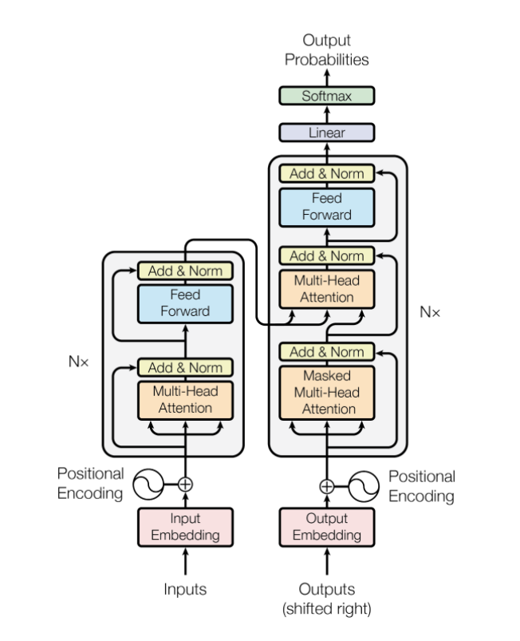
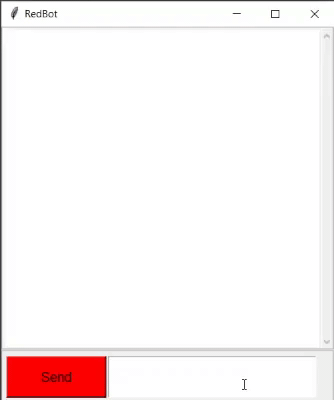

# RedBot
RedBot is a chatbot trained on Reddit comments dataset using a transformer model using Tensorflow framework. Also tkinter has been used to create a GUI which allows the user to interact with the chatbot.

## Installation and Setup
* Fork the repo and clone it.
```
git clone https://github.com/Frostday/RedBot.git
```
* Install the necessary packages required to run the code
```
pip install requirements.txt
```
* Run the following command
```
python -u chatbot_gui.py
```

## File Structure
- data folder contains the preprocessed data which was made using chatbot_database.py and create_training_data.py scripts.
- saved models folder contains the pretrained models and the colab notebook shows how these models were trained.
- chatbot_gui.py is the file which contains the code for GUI and model.py contains the code for reconstructing the pre-trained model so it can be used inside chatbot_gui.py file.

## Dataset
The raw dataset can be found here - http://files.pushshift.io/reddit/comments/.
This dataset contains millions of reddit comments and their responses from the year 2016 to 2020 from many different subreddits. I recommend downloading .xz files as they contain the same data as .bz2 files but use higher compression.

## Model
I used the model which was proposed in one of Google's research papers - "Attention is all you need". A basic implementation of this model can be found here - https://blog.tensorflow.org/2019/05/transformer-chatbot-tutorial-with-tensorflow-2.html.



## Results

- 200 epochs and 100,000 observations

| Loss   | Accuracy |
|:-------|:---------|
| 0.6568 | 0.2676   |

## Preview

